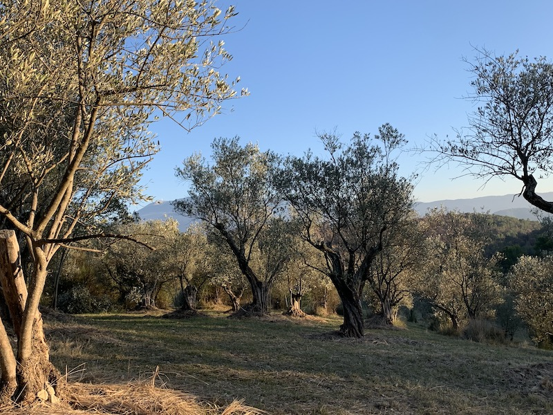

# {{ title }}

Depuis plus d'une centaine d'années sont récoltées des olives de
variété tanche sur ces parcelles distribuées dans une vallée
en AOC Nyons.

## Localisation

Les Saintes Fonts est un ensemble de parcelles réparties sur les
communes de Saint-Romain-en-Viennois et Faucon en Nord-Vaucluse.
L'AOC Nyons, fondée en 1994 s'étend sur le sud de la Drôme et le
Nord du Vaucluse.
(<a href="https://www.openstreetmap.org/#map=17/44.24679/5.12586"
rel="nofollow" target="_blank">voir carte</a>)

## Histoire

Ces arbres ont été abandonnés lors du gel de 1956<a id="cite_ref-1" href="#ref-1">1</a>,
puis remis en état au début des années 2000.

Tous les ans, nous récoltons les olives, et nous essayons de prendre quelques photos

 * <a href="https://ryogasp.com/1310">2010: le haut des saintes</a>
 * 2011: pas de photos
 * 2012: pas de photos
 * 2013: pas de photos
 * 2014: pas de photos
 * <a href="https://ryogasp.com/2092">2015: récolte des acrobates</a>
 * 2016: pas de photos
 * 2017: pas de photos
 * <a href="https://ryogasp.com/2385">2018: récolte des belles doches</a>
 * <a href="https://ryogasp.com/2458">2019: pas de récolte</a>
 * <a href="https://ryogasp.com/2525">2020: cueillette allongée</a>

## Production

Les oliviers sont plus naturels que bio: aucun
engrais, insecticide, ni autre produit
phytosanitaire n'a jamais été utilisé.
Cette méthode pose certains <i>problèmes</i>
notamment concernant la mouche de l'olive<a id="cite_ref-2" href="#ref-2">2</a>,
c'est pour cela que nous n'avons pas de récolte
tous les ans.

Les sols sont enherbés, les ronces sont enlevées
à la main, et une fois par an un voisin passe
une faucheuse mécanisée dans une partie des terres.

Les oliviers sont taillés à la main, et depuis 2019
Élyna utilise sa petite tronçonneuse, sinon c'est
uniquement au sécateur.

## Récolte

Les olives sont récoltées à la main, nous n'utilisons ni filets
ni machines qui secouent les arbres.

La récolte est un moment convivial de fête et de
piques-niques quand le temps le permet où famille
et amis viennent donner main forte en échange d'huile d'olive.

Les fruits sont récoltés mûrs, quand les olives sont bien noires
et un peu frippées, généralement c'est en décembre.

## Presse

Les olives sont pressées chez M. Farnoux dans son nouveau moulin qui
se trouve à Puyméras; il a fallu abandonner depuis peu l'ancien moulin
qui se trouvait dans Mirabel ("il fallait bien se mettre aux normes"
dit M. Farnoux).

L'huile est extraite de la première (et seule) pression, à froid.

## Agréments et labels

Nous n'avons pas le label "Bio", parce que c'est compliqué les labels.
Par contre, on est en AOC Olive noire de Nyons.

## Prix

C'est un peu compliqué de déterminer un prix par rapport aux frais,
parce qu'on n'a pas d'objectif de rentabilité, donc on se cale sur
les autres producteurs du coin
(<a href="https://www.vignolis.fr/fr/catalogue/f1-2-nos-huiles-d-olive/id-265-macerat-huile-d-olives-noires-de-nyons-aop-3l" target="_blank" rel="nofollow">Coopérative de Nyons</a> et
<a href="https://www.levieuxmoulinfarnoux.fr/produit/bidon-5l-huile-tanche/" target="_blank" rel="nofollow">Moulin Farnoux</a>).

 * Prix au bidon de 5 litres&nbsp;: <b>100 €</b>
 * Prix à la bouteille de 1 litre&nbsp;: <b>21,50 €</b>
